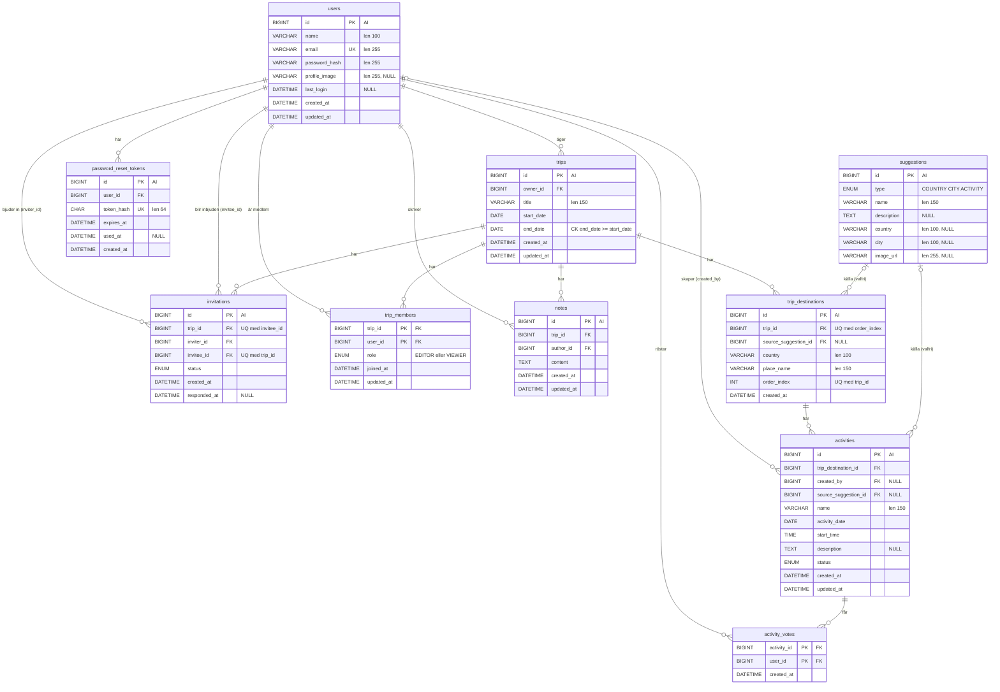

# ERD – Reseplanerare (MySQL)

```mermaid
erDiagram
    users ||--o{ trips : "äger"
    users ||--o{ invitations : "bjuder in (inviter_id)"
    users ||--o{ invitations : "blir inbjuden (invitee_id)"
    users ||--o{ trip_members : "är medlem"
    users ||--o{ password_reset_tokens : "har"
    users ||--o{ notes : "skriver"
    users ||--o{ activity_votes : "röstar"
    users |o--o{ activities : "skapar (created_by)"

    trips ||--o{ invitations : "har"
    trips ||--o{ trip_members : "har"
    trips ||--o{ trip_destinations : "har"
    trips ||--o{ notes : "har"

    trip_destinations ||--o{ activities : "har"
    activities ||--o{ activity_votes : "får"

    suggestions |o--o{ trip_destinations : "källa (valfri)"
    suggestions |o--o{ activities : "källa (valfri)"

    users {
        BIGINT id PK "AI"
        VARCHAR name "len 100"
        VARCHAR email UK "len 255"
        VARCHAR password_hash "len 255"
        VARCHAR profile_image "len 255, NULL"
        DATETIME last_login "NULL"
        DATETIME created_at
        DATETIME updated_at
    }

    invitations {
        BIGINT id PK "AI"
        BIGINT trip_id FK "UQ med invitee_id"
        BIGINT inviter_id FK
        BIGINT invitee_id FK "UQ med trip_id"
        ENUM status
        DATETIME created_at
        DATETIME responded_at "NULL"
    }

    trips {
        BIGINT id PK "AI"
        BIGINT owner_id FK
        VARCHAR title "len 150"
        DATE start_date
        DATE end_date "CK end_date >= start_date"
        DATETIME created_at
        DATETIME updated_at
    }

    trip_destinations {
        BIGINT id PK "AI"
        BIGINT trip_id FK "UQ med order_index"
        BIGINT source_suggestion_id FK "NULL"
        VARCHAR country "len 100"
        VARCHAR place_name "len 150"
        INT order_index "UQ med trip_id"
        DATETIME created_at
    }

    activities {
        BIGINT id PK "AI"
        BIGINT trip_destination_id FK
        BIGINT created_by FK "NULL"
        BIGINT source_suggestion_id FK "NULL"
        VARCHAR name "len 150"
        DATE activity_date
        TIME start_time
        TEXT description "NULL"
        ENUM status
        DATETIME created_at
        DATETIME updated_at
    }

    suggestions {
        BIGINT id PK "AI"
        ENUM type "COUNTRY CITY ACTIVITY"
        VARCHAR name "len 150"
        TEXT description "NULL"
        VARCHAR country "len 100, NULL"
        VARCHAR city "len 100, NULL"
        VARCHAR image_url "len 255, NULL"
    }

    trip_members {
        BIGINT trip_id PK "FK"
        BIGINT user_id PK "FK"
        ENUM role "EDITOR eller VIEWER"
        DATETIME joined_at
        DATETIME updated_at
    }

    activity_votes {
        BIGINT activity_id PK "FK"
        BIGINT user_id PK "FK"
        DATETIME created_at
    }

    password_reset_tokens {
        BIGINT id PK "AI"
        BIGINT user_id FK
        CHAR token_hash UK "len 64"
        DATETIME expires_at
        DATETIME used_at "NULL"
        DATETIME created_at
    }

    notes {
        BIGINT id PK "AI"
        BIGINT trip_id FK
        BIGINT author_id FK
        TEXT content
        DATETIME created_at
        DATETIME updated_at
    }
```
